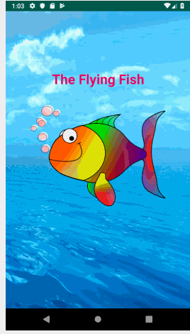

# Flying Fish Game
An android game, developed on Android Studio, that allows user to fly fish up and down screen to accumulate points and/or lose lives.
Submitted by: **Laura Molina**

Time spent: **4** hours spent in total

## User Stories

The following **required** functionality is completed:

* [X] User can **fly a fish up and down a screen with taps**
* [x] User can **view score and number of lives left**
* [X] User **can play game again

## Video Walkthrough

Here's a walkthrough of implemented user stories:

GIF created with [LiceCap](http://www.cockos.com/licecap/).
Game inspired by CodingCafe.
